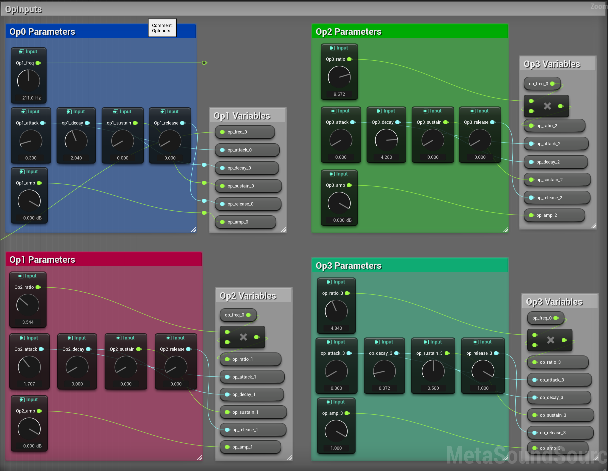
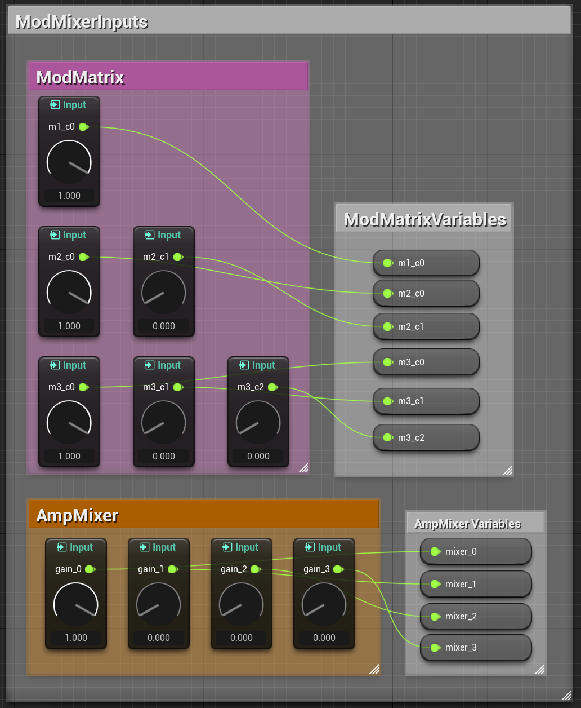
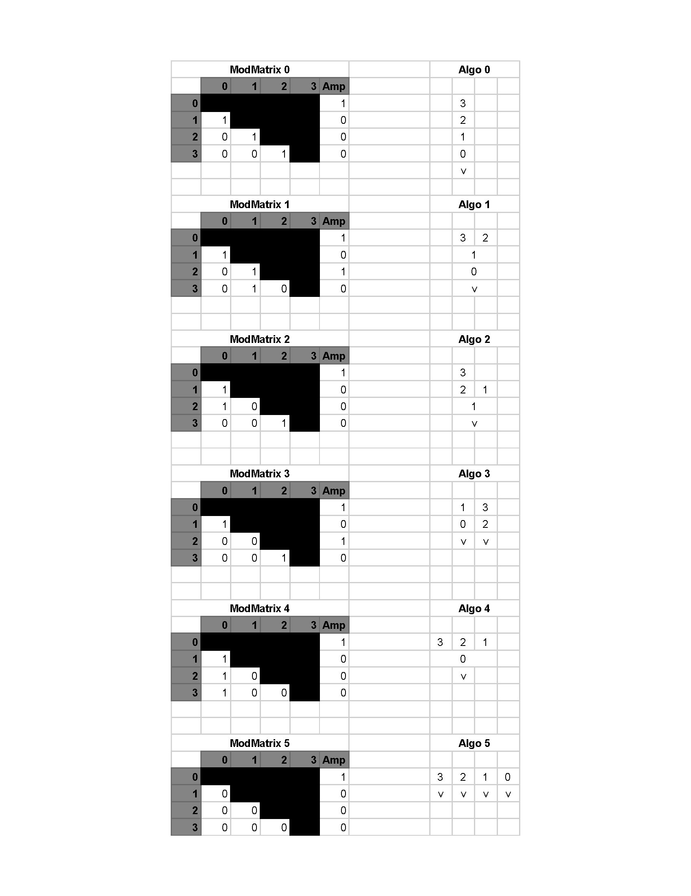
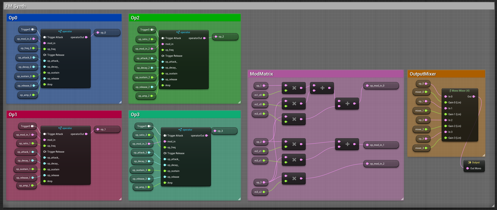
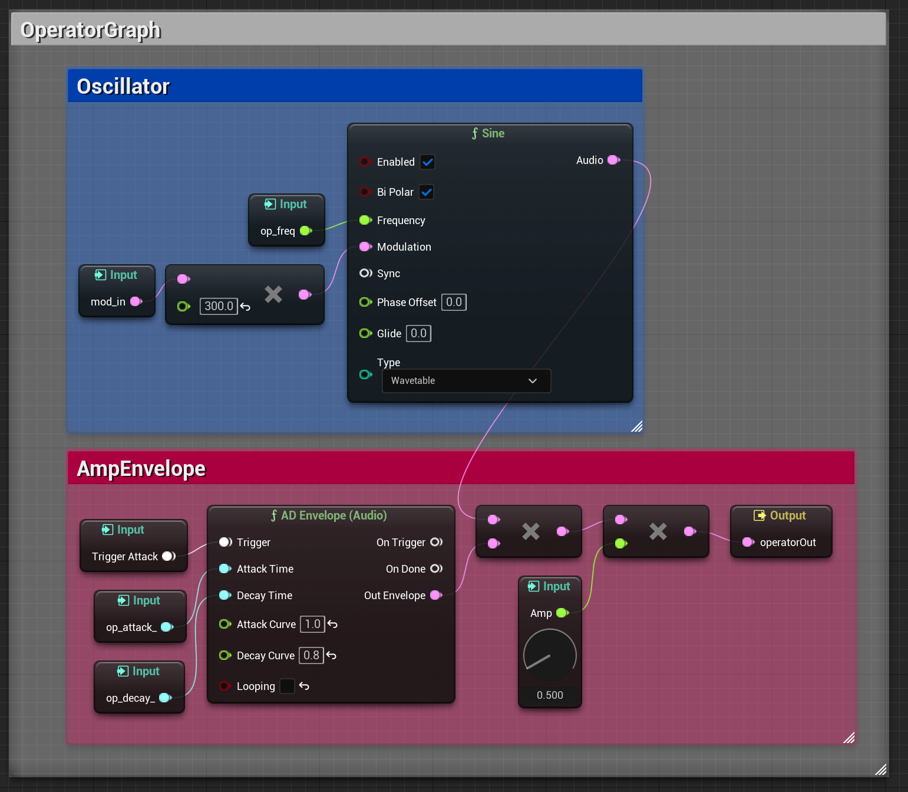
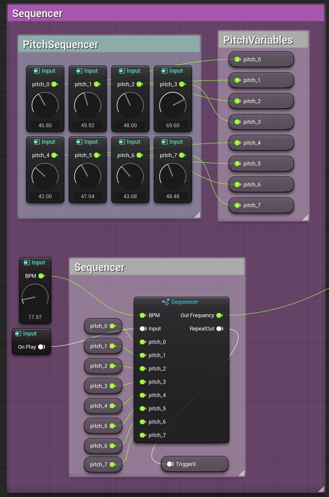
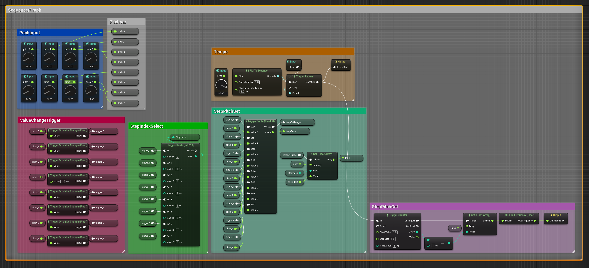
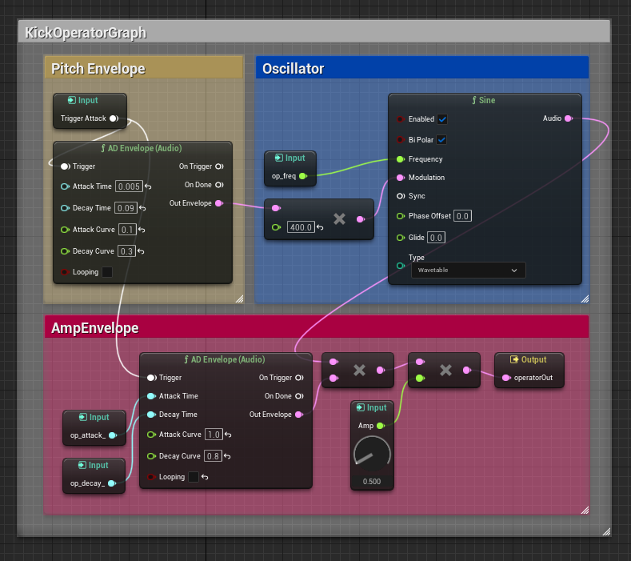
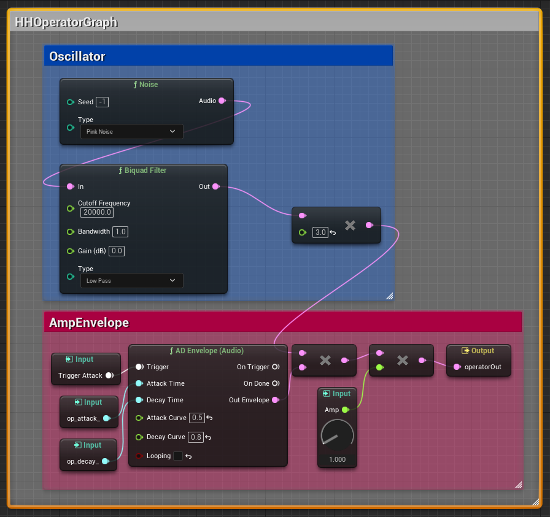

# UE5_Dynamic_Synth

# FM Synth/Sequencer

## Main Synth/Sequencer MetaSound

### FM Synth

### Operator Parameter Input

### ModMatrix Inputs

### Algorithm Cheat Sheet

### Output

### FM Operator Graph

### Sequencer Input

Sequencer Graph

## Specialized Operators

### Kick Operator

### HH Operator

