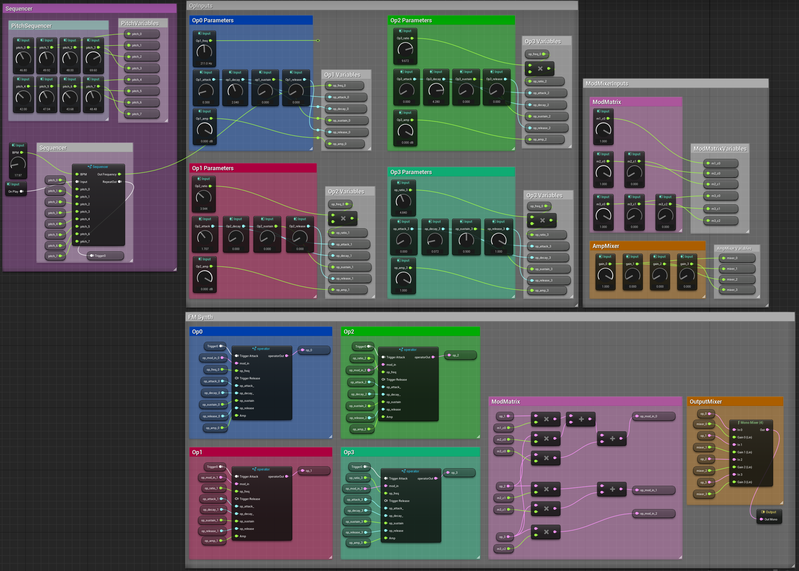
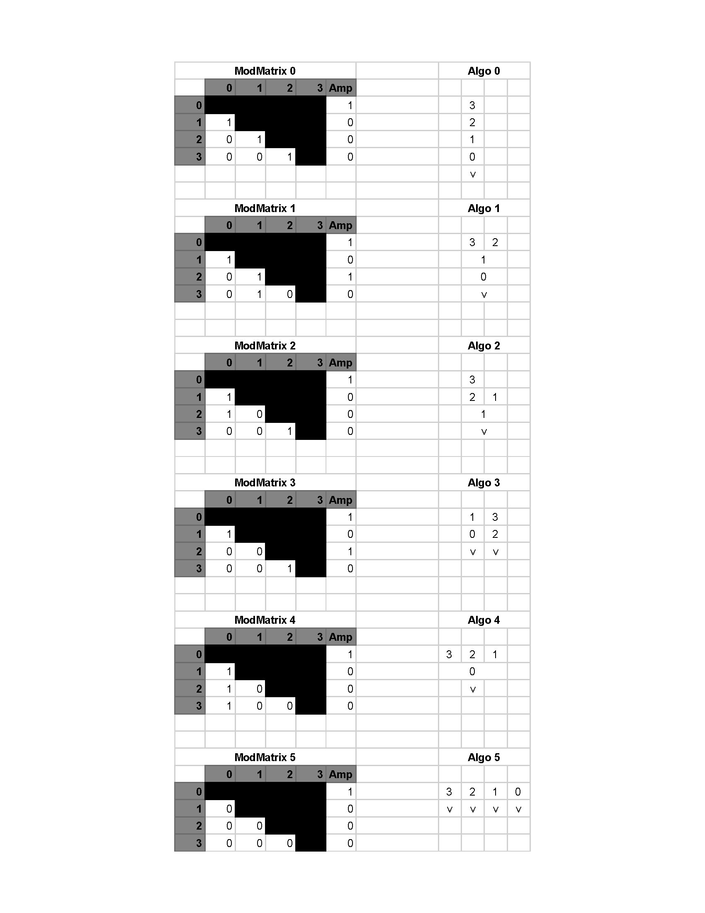
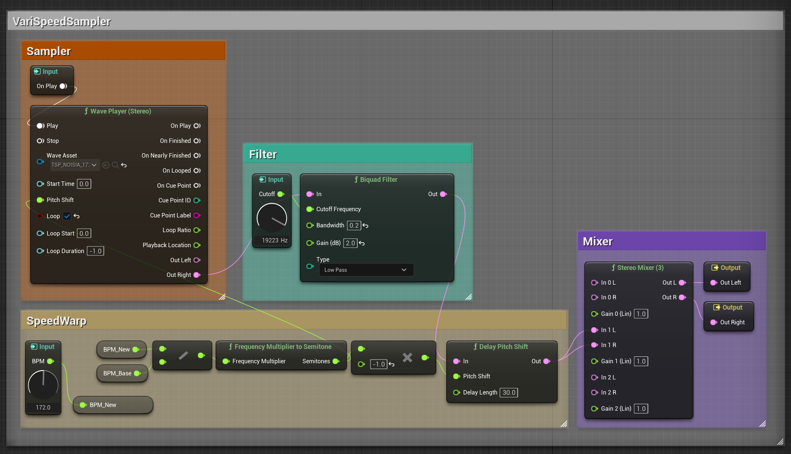

# UE5_Dynamic_Synth

A collection of modular sound devices and interactive systems built in and around MetaSounds in Unreal Engine 5.1. Levels are designed to demonstrate different methods of interaction.

### System requirements: UE 5.1+

# Sound Modules
All sound devices can be accessed UE5_DynamicSynth/Content/Synths
## Main Synth/Sequencer MetaSound
A MetaSound source combines an 8-step sequencer with a 4-operator FM synth. This MetaSound source allows for experimentation within the patch as well as through blueprints outside the patch.

### FM Synth
A 4-operator FM Synth with a comprehensive mod matrix. Pre-loaded with traditional sine-wave oscillators, the operators can be substituted with specialized percussive operators.
### Operator Parameter Input

### ModMatrix Inputs
While the interface offers continuous control over modulation amplitude, it is recommended that users set the index to either 0.0 or 1.0. To adjust the amplitude of a given operator, use the parameter exposed within the "Op# Parameter" window.

### Algorithm Cheat Sheet

### Output

### FM Operator Graph
Encapsulated within the graph is a sine oscillator with a dedicated AD VCA.

### Sequencer Input

### Sequencer Graph

## Specialized Operators

### Kick Operator

### HH Operator

# VariSpeedSampler

A workaround for implementing a sampler that can alter the pitch or timing of a sample independently.

# Levels
All interactions described below are contained within level Blueprints. These levels have been designed to clearly ilillustrate a simple dynamic audio system implementation sound modules included in the project.
## DynamicSynth

DynamicSynth illustrates a use case for the Quartz Clock. Quartz is initiated at BeginPlay. The player can arm/play and pause 3 Quartz synchronized sequences: Kick, HH and Bass.

Upon colliding with one of the three cubes, the sequence is armed and will begin playing at the onset of the next measure.

## DynamicSpeed

The player's distance from a cube at the far end of the map determines the tempo of the looping sample. This level employs the time warping workaround built into the VariSynthSampler. Currently, the base tempo of the sample is set manually, but in the future BPM could be included in the metadata of the sample so that the base BPM can be determined procedurally.

# DynamicSpeedRamp

Similar to DynamicSpeed, DynamicSpeedRamp allows the player to initialize speed ramps by colliding with trigger volumes. Upon collision with a trigger volume, the loop's tempo ramps up or down until reaching its determined limit.

# DynamicFilter

The player's position along the Z axis is mapped to the cutoff frequency of an LP filter affecting the audio loop.
